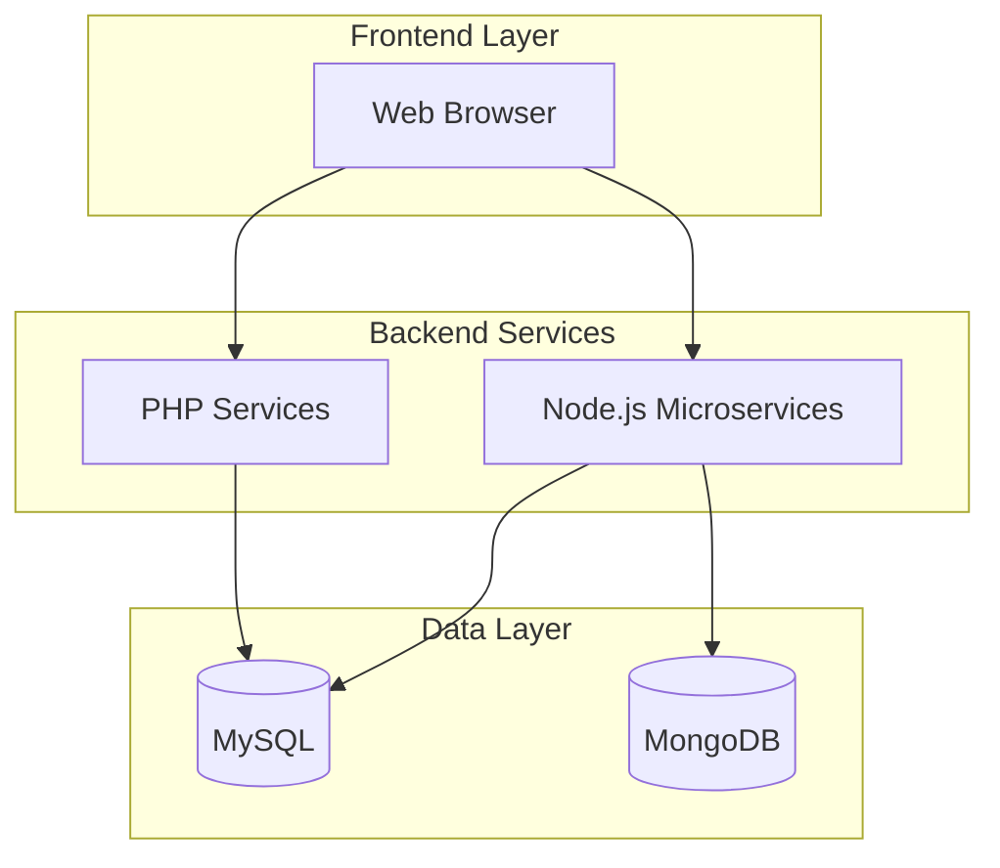

# 🌱 GreenGuru: Sustainable E-Commerce Platform

> Empowering eco-conscious shopping with a sustainability-first approach

   

## 🌟 About

GreenGuru is a sustainable e-commerce platform designed to promote environmental consciousness through eco-friendly product offerings. The platform differentiates itself by featuring products with sustainability scores, enabling consumers to make environmentally informed purchasing decisions. [1](#0-0) 

### 🎯 Mission

To provide consumers with sustainable shopping options while promoting environmental awareness through a user-friendly e-commerce experience. [2](#0-1) 

## ✨ Key Features

### 🛍️ Customer Experience
- **Sustainable Product Catalog** - Browse eco-friendly products with 0-10 sustainability scores
- **Smart Shopping Cart** - Persistent cart with real-time updates
- **Secure Checkout** - Dual payment gateway support (Stripe & Razorpay)
- **Order Tracking** - Complete order history and status updates
- **Responsive Design** - Seamless experience across all devices

### 🛠️ Admin Dashboard
- **Product Management** - Full CRUD operations with sustainability scoring
- **User Management** - Comprehensive user administration
- **Order Management** - Real-time order processing and tracking
- **Analytics** - Sales metrics and performance insights

## 🏗️ Architecture Overview

GreenGuru employs a **hybrid multi-tier architecture** combining Node.js microservices with PHP monolithic services:



### Technology Stack

| Layer | Technology | Purpose |
|-------|------------|---------|
| **Frontend** | HTML5, CSS3, JavaScript ES6+ | Modern, responsive UI |
| **Backend** | PHP 7.4+, Node.js, Express.js | Hybrid architecture |
| **Database** | MySQL 8.0+, MongoDB | Polyglot persistence |
| **Payments** | Stripe, Razorpay | Global payment processing |
| **Tools** | Git, phpMyAdmin, XAMPP | Development workflow | [3](#0-2) 

## 🚀 Quick Start

### Prerequisites
- PHP 7.4 or higher
- MySQL 8.0 or higher
- Apache/Nginx web server
- Node.js (for microservices)

### Installation

1. **Clone the repository**
   ```bash
   git clone https://github.com/Vinayak0987/GreenGuru.git
   cd GreenGuru
   ```

2. **Database Setup**
   ```sql
   CREATE DATABASE project;
   -- Import schema from documentation.md
   ```

3. **Configure Database**
   Edit `dashboard/includes/db.php` with your credentials:
   ```php
   $servername = "localhost";
   $username = "root";
   $password = "";
   $dbname = "project";
   ```

4. **Start Node.js Services**
   ```bash
   cd greenguru-backend && npm install && node server.js
   cd greenguru-billing && npm install && node server.js
   ```

5. **Access the Application**
   - Homepage: `http://localhost/project/Home%20page/index.html`
   - Admin Dashboard: `http://localhost/project/dashboard/` [4](#0-3) 

## 📊 Database Schema

The platform uses MySQL for core e-commerce data with the following key tables:

- **users** - Customer accounts and authentication
- **products** - Product catalog with sustainability scores
- **cart** - Shopping cart persistence
- **orders** - Order management and tracking
- **order_items** - Product-order relationships [5](#0-4) 

## 🔒 Security Features

- **Authentication** - Password hashing with PHP's `password_hash()`
- **Session Management** - Secure session-based authentication
- **SQL Injection Prevention** - Prepared statements throughout
- **Input Validation** - Comprehensive sanitization
- **CSRF Protection** - Form security measures [6](#0-5) 

## 🌍 Sustainability Focus

What makes GreenGuru unique:

- **Sustainability Scoring** - Every product rated 0-10 for environmental impact
- **Eco-Friendly Curation** - Hand-picked green alternatives
- **Environmental Awareness** - Educational content throughout the shopping experience
- **Transparent Metrics** - Clear visibility into product sustainability

## 📈 Future Roadmap

- **Payment Expansion** - PayPal integration and digital wallets
- **Carbon Tracking** - Personal carbon footprint calculator
- **Mobile App** - Native iOS and Android applications
- **AI Recommendations** - Sustainable product suggestions
- **Social Features** - Community challenges and sharing [7](#0-6) 

## 🤝 Contributing

We welcome contributions to make GreenGuru more sustainable and user-friendly!

1. Fork the repository
2. Create a feature branch (`git checkout -b feature/amazing-feature`)
3. Commit your changes (`git commit -m 'Add amazing feature'`)
4. Push to the branch (`git push origin feature/amazing-feature`)
5. Open a Pull Request

## 📞 Support

- **Technical Support**: technical@greenguru.com
- **Admin Support**: admin@greenguru.com
- **General Inquiries**: info@greenguru.com

## 📜 License

This project is licensed under the MIT License - see the [LICENSE](LICENSE) file for details.

---

<div align="center">

**🌱 Made with passion for a sustainable future 🌱**

[⭐ Star this repo](https://github.com/Vinayak0987/GreenGuru) | [🐛 Report Issues](https://github.com/Vinayak0987/GreenGuru/issues) | [📖 Documentation](https://github.com/Vinayak0987/GreenGuru/wiki)

</div>

## Notes
This README is crafted based on the comprehensive documentation available in the repository. The project structure reflects a hybrid architecture approach combining traditional PHP e-commerce patterns with modern Node.js microservices. The sustainability scoring system (0-10 scale in `products.sustainability_score`) is the key differentiator that sets this platform apart from conventional e-commerce solutions. For detailed technical implementation, refer to the `documentation.md` file and the wiki pages in the repository.

Wiki pages you might want to explore:
- [GreenGuru E-Commerce Platform Overview (Vinayak0987/GreenGuru)](/wiki/Vinayak0987/GreenGuru#1)

### Citations

**File:** documentation.md (L18-32)
```markdown
## Project Overview

**GreenGuru** is a sustainable e-commerce platform focused on eco-friendly products. The platform promotes environmental consciousness by featuring products with sustainability scores and eco-friendly alternatives to everyday items.

### Mission
To provide consumers with sustainable shopping options while promoting environmental awareness through a user-friendly e-commerce experience.

### Key Features
- Sustainable product catalog with eco-ratings
- User authentication and profile management
- Shopping cart and checkout system
- Order management and tracking
- Admin dashboard for product and user management
- Responsive design for mobile and desktop

```

**File:** documentation.md (L35-56)
```markdown
## Technology Stack

### Frontend
- **HTML5** - Semantic markup and structure
- **CSS3** - Styling and responsive design
- **JavaScript (ES6+)** - Client-side interactivity
- **Responsive Design** - Mobile-first approach

### Backend
- **PHP 7.4+** - Server-side scripting
- **MySQL 8.0+** - Relational database management
- **Apache/Nginx** - Web server

### Development Tools
- **phpMyAdmin** - Database administration
- **Git** - Version control
- **XAMPP/WAMP** - Local development environment

### Additional Libraries
- **Font Awesome** - Icons
- **Custom CSS Framework** - Styling system

```

**File:** documentation.md (L59-140)
```markdown
## Database Schema

The application uses a MySQL database named `project` with the following tables:

### 1. Users Table
\`\`\`sql
CREATE TABLE users (
    id INT PRIMARY KEY AUTO_INCREMENT,
    username VARCHAR(50) UNIQUE NOT NULL,
    email VARCHAR(100) UNIQUE NOT NULL,
    password VARCHAR(255) NOT NULL,
    created_at TIMESTAMP DEFAULT CURRENT_TIMESTAMP
);
\`\`\`

**Purpose**: Stores user account information with encrypted passwords.

### 2. Products Table
\`\`\`sql
CREATE TABLE products (
    product_index_no INT PRIMARY KEY AUTO_INCREMENT,
    name VARCHAR(255) NOT NULL,
    price DECIMAL(10,2) NOT NULL,
    rating DECIMAL(2,1) DEFAULT 0,
    sustainability_score INT DEFAULT 0,
    image VARCHAR(255),
    DESCRIPTION TEXT
);
\`\`\`

**Purpose**: Contains product catalog with sustainability metrics.

### 3. Cart Table
\`\`\`sql
CREATE TABLE cart (
    id INT PRIMARY KEY AUTO_INCREMENT,
    user_id INT NOT NULL,
    product_index_no INT NOT NULL,
    quantity INT DEFAULT 1,
    FOREIGN KEY (user_id) REFERENCES users(id),
    FOREIGN KEY (product_index_no) REFERENCES products(product_index_no)
);
\`\`\`

**Purpose**: Manages user shopping cart items.

### 4. Orders Table
\`\`\`sql
CREATE TABLE orders (
    order_id INT PRIMARY KEY AUTO_INCREMENT,
    user_id INT NOT NULL,
    full_name VARCHAR(100) NOT NULL,
    email VARCHAR(100) NOT NULL,
    address TEXT NOT NULL,
    city VARCHAR(50) NOT NULL,
    country VARCHAR(50) NOT NULL,
    postal_code VARCHAR(20) NOT NULL,
    subtotal DECIMAL(10,2) NOT NULL,
    tax DECIMAL(10,2) NOT NULL,
    total DECIMAL(10,2) NOT NULL,
    payment_id VARCHAR(100),
    order_date TIMESTAMP DEFAULT CURRENT_TIMESTAMP,
    FOREIGN KEY (user_id) REFERENCES users(id)
);
\`\`\`

**Purpose**: Stores completed order information and billing details.

### 5. Order Items Table
\`\`\`sql
CREATE TABLE order_items (
    id INT PRIMARY KEY AUTO_INCREMENT,
    order_id INT NOT NULL,
    product_index_no INT NOT NULL,
    quantity INT NOT NULL,
    FOREIGN KEY (order_id) REFERENCES orders(order_id),
    FOREIGN KEY (product_index_no) REFERENCES products(product_index_no)
);
\`\`\`

**Purpose**: Links products to orders with quantities (many-to-many relationship).

```

**File:** documentation.md (L269-318)
```markdown
### Prerequisites
- PHP 7.4 or higher
- MySQL 8.0 or higher
- Apache/Nginx web server
- phpMyAdmin (recommended)

### Step 1: Environment Setup
1. Install XAMPP/WAMP/MAMP for local development
2. Start Apache and MySQL services
3. Access phpMyAdmin at `http://localhost/phpmyadmin`

### Step 2: Database Setup
1. Create a new database named `project`
2. Import the database schema:
\`\`\`sql
-- Run the SQL commands from the Database Schema section
-- Or import from provided SQL dump file
\`\`\`

### Step 3: Project Installation
1. Clone/download the project files
2. Place files in your web server directory (htdocs for XAMPP)
3. Configure database connection in `dashboard/includes/db.php`:
\`\`\`php
<?php
$servername = "localhost";
$username = "root";
$password = "";
$dbname = "project";

$conn = new mysqli($servername, $username, $password, $dbname);
if ($conn->connect_error) {
    die("Connection failed: " . $conn->connect_error);
}
?>
\`\`\`

### Step 4: File Permissions
Ensure proper file permissions for image uploads and session management:
\`\`\`bash
chmod 755 /path/to/project
chmod 644 /path/to/project/images/*
\`\`\`

### Step 5: Testing
1. Access the homepage: `http://localhost/project/Home%20page/index.html`
2. Test user registration and login
3. Verify admin dashboard access
4. Test product browsing and cart functionality

```

**File:** documentation.md (L375-397)
```markdown
## Security Features

### Authentication Security
- Password hashing using PHP's `password_hash()`
- Session-based authentication
- CSRF protection on forms
- Input validation and sanitization

### Database Security
- Prepared statements to prevent SQL injection
- Input validation on all user inputs
- Secure database connection handling

### File Security
- Restricted file upload types
- File size limitations
- Secure file naming conventions

### Session Security
- Secure session configuration
- Session timeout handling
- Session regeneration on login

```

**File:** documentation.md (L433-482)
```markdown
## Future Enhancements

### Planned Features
1. **Payment Integration**
   - PayPal integration
   - Stripe payment processing
   - Multiple payment methods

2. **Enhanced Sustainability**
   - Carbon footprint calculator
   - Eco-impact tracking
   - Sustainability badges

3. **User Experience**
   - Wishlist functionality
   - Product recommendations
   - Advanced search filters
   - Mobile app development

4. **Analytics & Reporting**
   - Sales analytics dashboard
   - User behavior tracking
   - Inventory management
   - Automated reporting

5. **Marketing Features**
   - Discount codes and coupons
   - Email marketing integration
   - Social media sharing
   - Loyalty program

### Technical Improvements
1. **Performance Optimization**
   - Database query optimization
   - Image compression and CDN
   - Caching implementation
   - Code minification

2. **Security Enhancements**
   - Two-factor authentication
   - Advanced fraud detection
   - Regular security audits
   - HTTPS enforcement

3. **Scalability**
   - Microservices architecture
   - Load balancing
   - Database sharding
   - Cloud deployment

```
